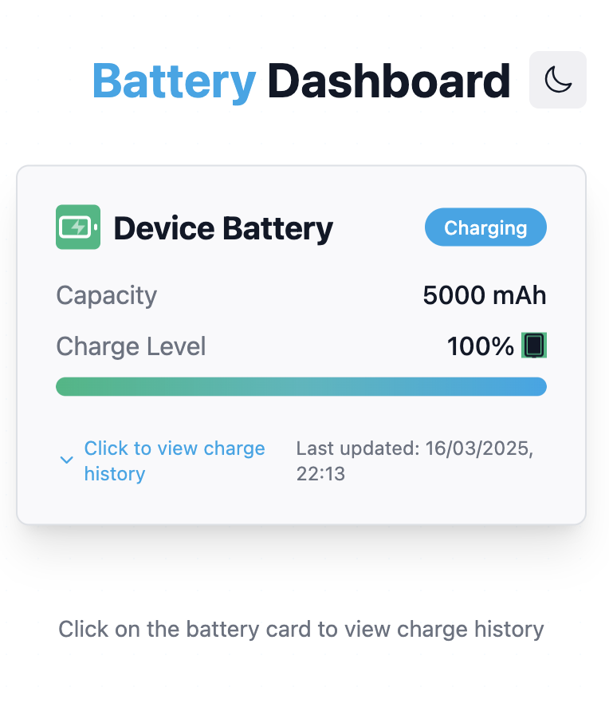
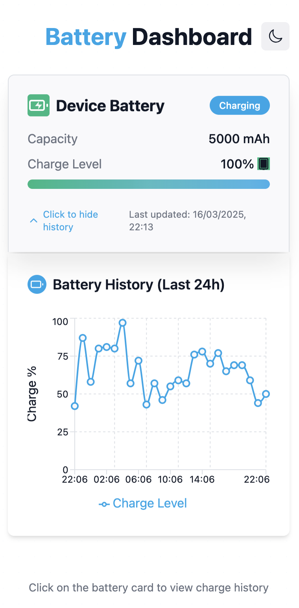
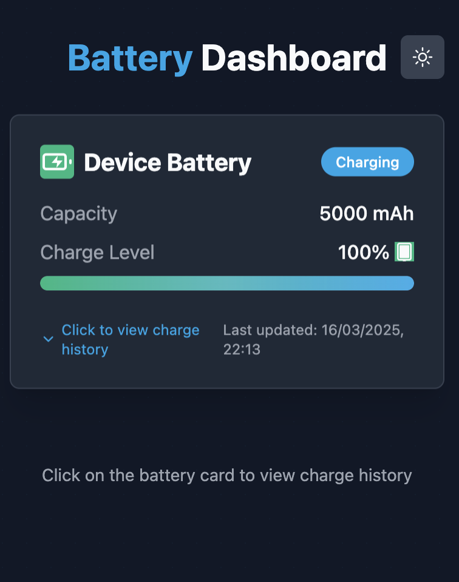
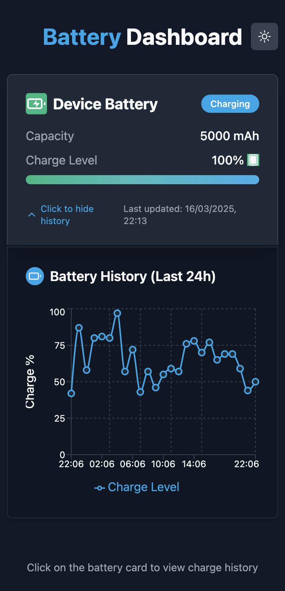

# Battery Dashboard

A responsive, interactive battery monitoring dashboard built with Next.js and Tailwind CSS. The dashboard displays your device's battery information with a sleek UI and interactive charge history chart.

## Features

- Real-time battery status monitoring
- Interactive charge history graph
- Light and dark mode support
- Responsive design for all devices
- Animated UI with modern design principles
- Battery level visualisation
- Charging status indicators

## Screenshots

The dashboard has four main display modes:

### Light Mode (Collapsed and Expanded)



### Dark Mode (Collapsed and Expanded)



## Getting Started

### Prerequisites

- Node.js 16.x or later
- npm or yarn

### Installation

1. Clone the repository:

```bash
git clone https://github.com/yourusername/battery-dashboard.git
cd battery-dashboard
```

2. Install dependencies:

```bash
npm install
# or
yarn install
```

3. Start the development server:

```bash
npm run dev
# or
yarn dev
```

4. Open [http://localhost:3000](http://localhost:3000) in your browser to see the dashboard.

## Usage

- **View Battery Status**: The main card displays your current battery level, charging status, and capacity.
- **See Charge History**: Click on the battery card to expand and view your battery's charge history over time.
- **Switch Themes**: Toggle between light and dark modes using the theme button in the top right corner.

## How It Works

The dashboard uses the Web Battery API to gather information about your device's battery. If this API isn't available, it falls back to simulated data.

Key components:
- `BatteryCard.tsx`: Main UI component displaying battery information
- `BatteryChart.tsx`: Interactive chart showing battery level history
- `useBatteryData.ts`: Custom hook that manages battery state
- `batteryUtils.ts`: Utility functions for formatting and processing battery data

## Technologies Used

- **Next.js**: React framework for server-rendered applications
- **Tailwind CSS**: Utility-first CSS framework
- **Recharts**: Composable charting library for React
- **TypeScript**: Typed JavaScript
- **Web Battery API**: Browser API for accessing battery information

## Customisation

### Changing Colors

Edit the color variables in `src/app/globals.css` to customize the theme colors.

### Adding Multiple Batteries

The architecture supports monitoring multiple batteries. To implement this:

1. Modify the `useBatteryData` hook to track multiple battery sources
2. Update the UI to display multiple battery cards
3. Adjust the chart to allow selecting which battery history to display

## Browser Support

The dashboard works best in browsers that support the Web Battery API:
- Chrome
- Firefox
- Edge
- Opera

In browsers without battery API support, it will use simulated data for demonstration purposes.

---

Made with ❤️ by Conor